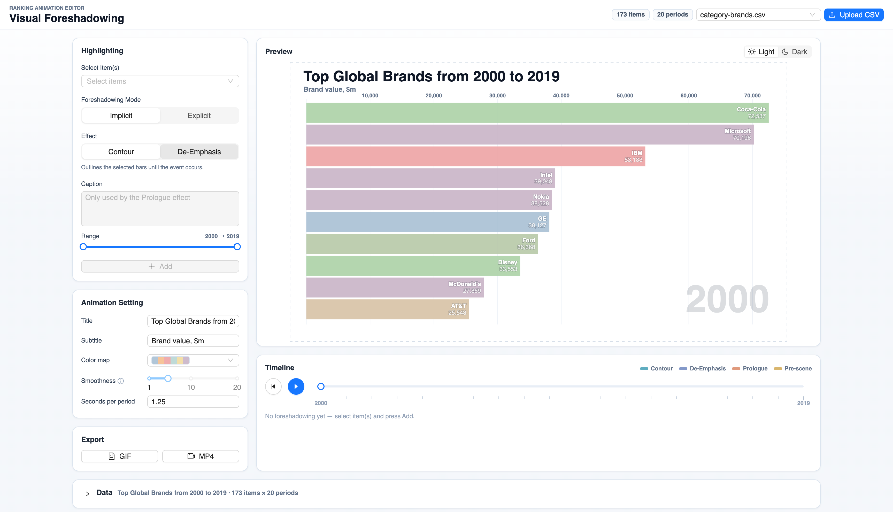

# foreshadowing

A browser-based **bar chart race** editor with visual foreshadowing and an animated ranking preview. Load a time-series CSV, tune the animation and styling, preview it live, and export the result.



## Getting started

```bash
npm install      # install dependencies
npm start        # start the dev server (webpack-dev-server)
npm test         # run the test suite (vitest)
npm run build    # production build into dist/
```

Then open the URL printed in the terminal.

## Data presets

Sample datasets live in [`data/`](data/) and are bundled at build time via `csv-loader`, then registered as presets in [`src/index.tsx`](src/index.tsx):

- `category-brands.csv`
- `brand_values.csv`
- `spotify-us-weekly-16.csv`
- `test.csv`

To add your own preset, drop a CSV in `data/`, import it in `src/index.tsx`, and register it with `makePreset(...)`. You can also upload a CSV directly from the app UI at runtime.

## Project layout

```
src/
  chart/         chart color, layout, and theme logic
  components/    React UI (control panel, timeline, canvas, export)
  data/          dataset parsing and time-series helpers
  export/        GIF/MP4 frame rendering and encoding
  foreshadowing/ foreshadowing options, effect envelopes, and resolution
  index.tsx      entry point + built-in presets
data/            sample CSV datasets
```
